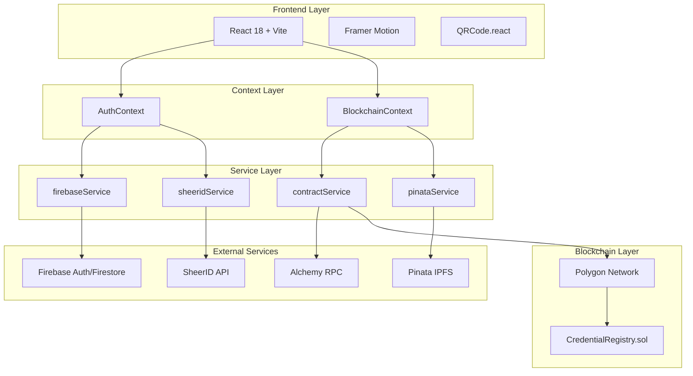

# Design Document: Hackathon Presentation

## Overview

This design document outlines the comprehensive hackathon presentation for the **Decentralized Academic Identity System (AcadChain)** - a production-grade DApp that solves the global problem of academic credential fraud using blockchain technology and Self-Sovereign Identity (SSI) principles.

The presentation will be structured as a detailed technical showcase with interactive MCQs, code deep-dives, and clear USP articulation.

---

## Architecture

### Presentation Structure

```
┌─────────────────────────────────────────────────────────────┐
│                    HACKATHON PRESENTATION                    │
├─────────────────────────────────────────────────────────────┤
│  1. Opening Hook & Problem Statement                         │
│  2. Solution Overview & Architecture                         │
│  3. Technical Deep Dive (Smart Contract)                     │
│  4. Technical Deep Dive (Frontend/Web3)                      │
│  5. User Flow Demonstrations                                 │
│  6. USPs & Competitive Advantages                            │
│  7. Security & Verification                                  │
│  8. Technology Stack                                         │
│  9. Interactive MCQ Section                                  │
│  10. Future Roadmap                                          │
│  11. Demo & Closing                                          │
└─────────────────────────────────────────────────────────────┘
```

### System Architecture Diagram



---

## Components and Interfaces

### 1. Smart Contract Component (CredentialRegistry.sol)

```solidity
// Core Data Structures
struct Credential {
    address issuer;          // University wallet address
    string studentName;      // Student's full name
    string studentDID;       // Decentralized Identifier
    string courseName;       // Degree/Certificate name
    bytes32 credHash;        // Keccak256 hash for integrity
    string ipfsCID;          // IPFS Content Identifier
    uint256 timestamp;       // Block timestamp
    bool isValid;            // Validity status
    bool isRevoked;          // Revocation flag
}

struct Issuer {
    string name;             // Institution name
    bool isAuthorized;       // Authorization status
    uint256 registeredAt;    // Registration timestamp
}
```

**Key Functions:**
- `authorizeIssuer(address, string)` - Government authorizes universities
- `issueCredential(string, string, string, string, bytes32)` - Issue new credential
- `revokeCredential(bytes32)` - Revoke existing credential
- `isValidCredential(bytes32)` - Verify credential validity

### 2. BlockchainContext Component

```javascript
// Core State Management
const [walletAddress, setWalletAddress] = useState(null);
const [demoRole, setDemoRole] = useState(null);
const [credentialsCache, setCredentialsCache] = useState({});
const [issuersCache, setIssuersCache] = useState({});

// Key Functions Exposed
{
  account,                    // Current user account
  walletAddress,              // MetaMask wallet address
  role,                       // User role (student/university/government)
  connectWallet,              // Connect MetaMask
  issueCredential,            // Issue new credential
  verifyCredential,           // Verify credential hash
  revokeCredential,           // Revoke credential
  authorizeIssuer,            // Authorize university
  canPerformOnChainOps,       // Check blockchain capability
  isDemoMode                  // Check demo mode status
}
```

### 3. Service Layer Interfaces

**pinataService.js:**
```javascript
export const pinataService = {
  uploadJSON,      // Upload credential metadata to IPFS
  uploadFile,      // Upload certificate PDF to IPFS
  fetchByCID,      // Retrieve content from IPFS
  getGatewayUrl,   // Generate IPFS gateway URL
  testConnection   // Verify Pinata connectivity
};
```

**contractService.js:**
```javascript
export const contractService = {
  connectWallet,              // Connect MetaMask
  hashCredential,             // Generate keccak256 hash
  issueCredentialOnChain,     // Write to blockchain
  verifyCredentialOnChain,    // Read from blockchain
  isAuthorizedIssuer,         // Check issuer status
  switchToPolygon             // Network switching
};
```

---

## Data Models

### Credential Data Model (IPFS Storage)

```json
{
  "version": "1.0",
  "type": "academic_credential",
  "studentDID": "did:firebase:abc123 | 0x...",
  "studentName": "John Doe",
  "issuer": {
    "address": "0x...",
    "name": "MIT"
  },
  "credential": {
    "type": "certificate",
    "title": "B.Sc. Computer Science",
    "issuedDate": "2025-01-15T10:30:00Z"
  },
  "metadata": {
    "createdAt": 1736937000000,
    "network": "polygon"
  }
}
```

### User Profile Model (Firebase)

```javascript
{
  uid: "firebase_user_id",
  email: "student@university.edu",
  displayName: "John Doe",
  role: "student",
  walletAddress: "0x...",
  credentialRefs: ["hash1", "hash2"],
  isStudentVerified: true,
  sheerIdVerification: {
    verificationId: "sheerid_123",
    status: "approved",
    organization: { name: "MIT" },
    expiresAt: "2026-01-15"
  }
}
```

---

## Correctness Properties

*A property is a characteristic or behavior that should hold true across all valid executions of a system—essentially, a formal statement about what the system should do. Properties serve as the bridge between human-readable specifications and machine-verifiable correctness guarantees.*

### Property 1: Credential Hash Integrity
*For any* credential data object, the keccak256 hash generated client-side SHALL match the hash stored on-chain, ensuring tamper-proof integrity.
**Validates: Requirements 2.2, 3.4**

### Property 2: Authorization Enforcement
*For any* credential issuance attempt, the system SHALL reject the transaction if the caller's address is not in the authorizedIssuers mapping with isAuthorized=true.
**Validates: Requirements 3.2, 7.2**

### Property 3: IPFS Round-Trip Consistency
*For any* credential metadata uploaded to Pinata IPFS, fetching by the returned CID SHALL return identical JSON content.
**Validates: Requirements 2.3**

### Property 4: Revocation Immutability
*For any* revoked credential, subsequent calls to isValidCredential SHALL return false, and the isRevoked flag SHALL remain true permanently.
**Validates: Requirements 3.4, 7.4**

### Property 5: Role-Based Access Control
*For any* user session, the accessible features SHALL be determined solely by the authenticated role (student, university, government, verifier).
**Validates: Requirements 5.1, 5.2, 5.3, 5.4**

---

## Error Handling

### Smart Contract Errors
```solidity
require(msg.sender == admin, "Caller is not the admin/regulator");
require(authorizedIssuers[msg.sender].isAuthorized, "Caller is not an authorized issuer");
require(credentials[_credHash].timestamp == 0, "Credential already exists");
require(credentials[_credHash].issuer == msg.sender, "Only the issuer can revoke");
```

### Frontend Error Handling
```javascript
try {
  const result = await issueCredential(studentDID, studentName, courseName);
  addNotification('Success', 'Credential issued!', 'success');
} catch (err) {
  addNotification('Issue Failed', err.message, 'error');
  throw err;
}
```

---

## Testing Strategy

### Unit Tests
- Smart contract function tests using Hardhat
- Service layer function tests
- Component rendering tests

### Property-Based Tests
- Credential hash consistency across multiple inputs
- Authorization enforcement with random addresses
- IPFS upload/fetch round-trip verification

### Integration Tests
- End-to-end credential issuance flow
- Verification flow with on-chain lookup
- Demo mode fallback behavior

---

## Presentation Content Sections

### Section 1: Opening Hook & Problem Statement

**The Problem:**
- $1 Billion+ lost annually to credential fraud
- 30% of resumes contain falsified education claims
- Manual verification takes 2-4 weeks
- No global standard for credential verification

**The Solution:**
- Blockchain-anchored credentials (immutable)
- Instant verification (< 3 seconds)
- Self-sovereign identity (student owns data)
- W3C standards compliance

---

### Section 2: Technical Architecture Deep Dive

**Hybrid Architecture Benefits:**

| Layer | Technology | Purpose |
|-------|------------|---------|
| Storage | IPFS (Pinata) | Decentralized credential files |
| Trust | Polygon Blockchain | Immutable hash anchoring |
| Auth | Firebase | User management |
| Verification | SheerID | Student status validation |

**The 3-Step Trust Model:**

```
1. ISSUANCE
   University → Signs Credential → Uploads to IPFS → Anchors Hash on Polygon

2. PRESENTATION  
   Student → Generates QR Code → Shares with Employer

3. VERIFICATION
   Employer → Scans QR → Queries Blockchain → Gets Instant Result
```

---

### Section 3: Smart Contract Deep Dive

**CredentialRegistry.sol Key Code:**

```solidity
function issueCredential(
    string memory _studentName,
    string memory _studentDID,
    string memory _courseName,
    string memory _ipfsCID,
    bytes32 _credHash
) external onlyIssuer {
    require(credentials[_credHash].timestamp == 0, "Credential already exists");

    credentials[_credHash] = Credential({
        issuer: msg.sender,
        studentName: _studentName,
        studentDID: _studentDID,
        courseName: _courseName,
        credHash: _credHash,
        ipfsCID: _ipfsCID,
        timestamp: block.timestamp,
        isValid: true,
        isRevoked: false
    });

    credentialHashes.push(_credHash);
    emit CredentialIssued(_credHash, msg.sender, _studentDID);
}
```

**Role-Based Access Control:**

```solidity
modifier onlyAdmin() {
    require(msg.sender == admin, "Caller is not the admin/regulator");
    _;
}

modifier onlyIssuer() {
    require(authorizedIssuers[msg.sender].isAuthorized, 
            "Caller is not an authorized issuer");
    _;
}
```

---

### Section 4: Frontend/Web3 Integration

**ethers.js Integration:**

```javascript
// Hash credential data
export const hashCredential = (data) => {
  const jsonString = JSON.stringify(data);
  return ethers.keccak256(ethers.toUtf8Bytes(jsonString));
};

// Issue credential on-chain
export const issueCredentialOnChain = async (
  studentName, studentDID, courseName, ipfsCID, credHash
) => {
  const contract = await getWriteContract();
  const tx = await contract.issueCredential(
    studentName, studentDID, courseName, ipfsCID, credHash
  );
  const receipt = await tx.wait();
  return { txHash: tx.hash, blockNumber: receipt.blockNumber };
};
```

**React Context Pattern:**

```javascript
// BlockchainContext provides global blockchain state
<BlockchainContext.Provider value={{
  account,
  walletAddress,
  role,
  connectWallet,
  issueCredential,
  verifyCredential,
  // ... more
}}>
  {children}
</BlockchainContext.Provider>
```

---

### Section 5: User Flow Demonstrations

**Student Dashboard Flow:**
1. Connect wallet or use demo mode
2. Complete SheerID verification
3. View issued credentials
4. Generate QR code for sharing
5. Access public profile

**University Portal Flow:**
1. Connect authorized wallet
2. Enter student details
3. Upload certificate PDF to IPFS
4. Issue credential (writes to blockchain)
5. View issuance history

**Verifier Portal Flow:**
1. Enter credential hash or scan QR
2. System queries blockchain
3. Fetches metadata from IPFS
4. Displays verification result
5. Download verification report

---

### Section 6: Unique Selling Propositions (USPs)

| # | USP | Description |
|---|-----|-------------|
| 1 | **Tamper-Proof** | Credentials anchored on Polygon blockchain cannot be altered |
| 2 | **Instant Verification** | < 3 second verification vs 2-4 weeks traditional |
| 3 | **Self-Sovereign** | Students own their credentials, not institutions |
| 4 | **Cost-Effective** | $0.002 avg gas fee on Polygon vs $50+ traditional |
| 5 | **W3C Compliant** | Follows Verifiable Credentials 2.0 standard |
| 6 | **Privacy-First** | Selective disclosure planned (share only what's needed) |
| 7 | **Global Standard** | Works across borders, no central authority |
| 8 | **Revocation Support** | Institutions can revoke fraudulent credentials |
| 9 | **Multi-Gateway IPFS** | Redundant storage across 4 IPFS gateways |
| 10 | **Demo Mode** | Try without wallet for easy onboarding |

---

### Section 7: Security Features

**Cryptographic Security:**
- Keccak256 hashing for credential integrity
- ECDSA signatures via MetaMask
- Content-addressable storage (IPFS CID)

**Access Control:**
- Smart contract modifiers (onlyAdmin, onlyIssuer)
- Firebase authentication
- SheerID student verification

**Revocation Mechanism:**
```solidity
function revokeCredential(bytes32 _credHash) external onlyIssuer {
    require(credentials[_credHash].issuer == msg.sender, 
            "Only the issuer can revoke");
    credentials[_credHash].isValid = false;
    credentials[_credHash].isRevoked = true;
    emit CredentialRevoked(_credHash, msg.sender);
}
```

---

### Section 8: Technology Stack

**Frontend:**
- React 19.2.0 - UI framework
- Vite 7.2.4 - Build tool
- Framer Motion 12.23.26 - Animations
- React Router DOM 7.11.0 - Routing
- Recharts 3.6.0 - Analytics charts
- QRCode.react 4.2.0 - QR generation
- Lucide React 0.562.0 - Icons

**Blockchain:**
- Solidity ^0.8.19 - Smart contracts
- ethers.js 6.16.0 - Blockchain interaction
- Hardhat 2.28.0 - Development framework

**Backend Services:**
- Firebase 12.7.0 - Auth & Firestore
- Pinata SDK 2.1.0 - IPFS pinning
- Axios 1.13.2 - HTTP client

**Network:**
- Polygon Mainnet (Chain ID: 137)
- Alchemy RPC for reliable connectivity

---

### Section 9: Interactive MCQ Section

#### MCQ 1: Smart Contract Basics
**Q: What Solidity version is used in CredentialRegistry.sol?**
- A) ^0.7.0
- B) ^0.8.19 ✓
- C) ^0.9.0
- D) ^0.6.12

*Explanation: The contract uses Solidity ^0.8.19 which includes built-in overflow protection and improved error handling.*

---

#### MCQ 2: Data Storage
**Q: Where is the full credential metadata stored?**
- A) Entirely on Polygon blockchain
- B) In Firebase Firestore
- C) On IPFS via Pinata ✓
- D) In browser localStorage

*Explanation: Full metadata is stored on IPFS for cost efficiency. Only the hash is stored on-chain for verification.*

---

#### MCQ 3: Hashing Algorithm
**Q: Which hashing algorithm is used for credential integrity?**
- A) SHA-256
- B) MD5
- C) Keccak256 ✓
- D) Blake2b

*Explanation: Keccak256 is Ethereum's native hashing algorithm, used via ethers.keccak256().*

---

#### MCQ 4: Access Control
**Q: Who can authorize a university to issue credentials?**
- A) Any wallet holder
- B) The university itself
- C) Only the admin/government ✓
- D) Students

*Explanation: The authorizeIssuer function has the onlyAdmin modifier, restricting it to the government role.*

---

#### MCQ 5: IPFS Gateways
**Q: How many IPFS gateways does the system use for redundancy?**
- A) 1
- B) 2
- C) 4 ✓
- D) 6

*Explanation: The fetchByCID function tries Pinata, ipfs.io, cloudflare-ipfs, and dweb.link gateways.*

---

#### MCQ 6: React Context
**Q: Which context manages wallet connection state?**
- A) AuthContext
- B) BlockchainContext ✓
- C) WalletContext
- D) Web3Context

*Explanation: BlockchainContext handles walletAddress, connectWallet, and all blockchain operations.*

---

#### MCQ 7: Credential Struct
**Q: Which field in the Credential struct stores the IPFS location?**
- A) credHash
- B) ipfsCID ✓
- C) timestamp
- D) issuer

*Explanation: ipfsCID stores the Content Identifier returned by Pinata after upload.*

---

#### MCQ 8: Network
**Q: What is Polygon's chain ID?**
- A) 1
- B) 56
- C) 137 ✓
- D) 250

*Explanation: Polygon Mainnet uses chain ID 137 (0x89 in hex).*

---

#### MCQ 9: Gas Fees
**Q: What is the average gas fee on Polygon for credential issuance?**
- A) $5.00
- B) $0.50
- C) $0.002 ✓
- D) $0.00

*Explanation: Polygon's Layer 2 scaling provides extremely low gas fees, averaging $0.002.*

---

#### MCQ 10: Verification
**Q: What does isValidCredential(bytes32) return for a revoked credential?**
- A) true
- B) false ✓
- C) null
- D) Throws error

*Explanation: Once revoked, isValid is set to false, and the function returns this value.*

---

#### MCQ 11: DID Format
**Q: What DID format is used for Firebase-authenticated users?**
- A) did:ethr:0x...
- B) did:firebase:uid ✓
- C) did:web:domain
- D) did:key:z...

*Explanation: The generateCustodialDID function creates did:firebase:{uid} for non-wallet users.*

---

#### MCQ 12: Event Emission
**Q: Which event is emitted when a credential is issued?**
- A) CredentialCreated
- B) CredentialIssued ✓
- C) NewCredential
- D) IssueComplete

*Explanation: The contract emits CredentialIssued(credHash, issuer, studentDID) after successful issuance.*

---

#### MCQ 13: SheerID Integration
**Q: What is SheerID used for in this system?**
- A) Blockchain verification
- B) Student status verification ✓
- C) IPFS storage
- D) Payment processing

*Explanation: SheerID verifies that users are actually enrolled students before credentials can be issued to them.*

---

#### MCQ 14: Modifier Purpose
**Q: What does the onlyIssuer modifier check?**
- A) If caller is admin
- B) If caller is in authorizedIssuers with isAuthorized=true ✓
- C) If caller has MATIC balance
- D) If caller is a student

*Explanation: onlyIssuer requires authorizedIssuers[msg.sender].isAuthorized to be true.*

---

#### MCQ 15: Demo Mode
**Q: In demo mode, where are credentials stored?**
- A) Only on blockchain
- B) Only in browser memory
- C) On IPFS + local cache ✓
- D) Not stored at all

*Explanation: Demo mode uploads to IPFS (real) but stores in credentialsCache instead of blockchain.*

---

### Section 10: Future Roadmap

**Phase 1 (Current):**
- ✅ Core smart contract
- ✅ Student/University/Verifier portals
- ✅ IPFS integration
- ✅ Demo mode

**Phase 2 (Q2 2025):**
- 📱 Mobile app (iOS/Android)
- 🔐 Selective disclosure (ZK proofs)
- 🌐 Multi-chain support

**Phase 3 (Q4 2025):**
- 🏛️ EBSI integration
- 🤝 University consortium partnerships
- 📊 Advanced analytics dashboard

---

### Section 11: Demo Mode vs Production

| Feature | Demo Mode | Production |
|---------|-----------|------------|
| IPFS Storage | ✅ Real (Pinata) | ✅ Real (Pinata) |
| Blockchain | ❌ Local cache | ✅ Polygon mainnet |
| Wallet Required | ❌ No | ✅ MetaMask |
| Gas Fees | ❌ None | ✅ MATIC required |
| Credential Persistence | ❌ Session only | ✅ Permanent |
| Verification | ✅ Works | ✅ Works |

**Deployment Steps:**
```bash
# 1. Deploy contract
npx hardhat run scripts/deploy.js --network polygon

# 2. Update environment
VITE_CONTRACT_ADDRESS=0x...deployed_address

# 3. Verify on Polygonscan
npx hardhat verify --network polygon CONTRACT_ADDRESS
```

---

## File Structure Reference

```
├── contracts/
│   └── CredentialRegistry.sol    # Smart contract
├── src/
│   ├── contexts/
│   │   ├── AuthContext.jsx       # Authentication state
│   │   └── BlockchainContext.jsx # Blockchain state
│   ├── services/
│   │   ├── contractService.js    # ethers.js integration
│   │   ├── pinataService.js      # IPFS operations
│   │   ├── firebaseService.js    # Auth & Firestore
│   │   └── sheeridService.js     # Student verification
│   ├── pages/
│   │   ├── StudentDashboard.jsx  # Student wallet UI
│   │   ├── UniversityPortal.jsx  # Issuance UI
│   │   ├── VerifierPortal.jsx    # Verification UI
│   │   └── GovernmentDashboard.jsx # Admin UI
│   └── components/
│       └── ui/                   # Reusable UI components
├── scripts/
│   └── deploy.js                 # Hardhat deployment
└── hardhat.config.cjs            # Hardhat configuration
```
